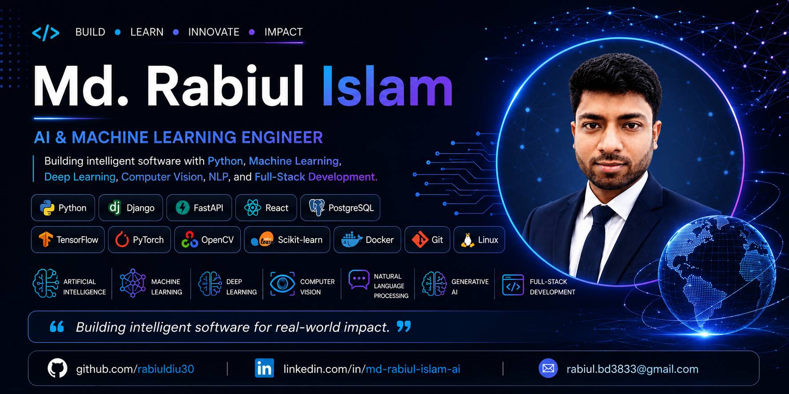

  

## 👨‍💻 About Me

I'm **Md. Rabiul Islam**, an **AI & Machine Learning Engineer** passionate about designing intelligent systems that solve real-world challenges.

My expertise includes **Machine Learning, Deep Learning, Computer Vision, NLP, Generative AI, and Full-Stack Python Development**. I build scalable applications using **Python, FastAPI, Django, React, PostgreSQL, TensorFlow, PyTorch, and modern AI frameworks**.

I'm particularly interested in **LLMs, AI Agents, RAG, and Computer Vision**, and I enjoy building production-ready AI applications and contributing to open-source projects.

### 🚀 Highlights

- 🤖 AI & Machine Learning Engineer
- 🐍 Python, FastAPI & Django Developer
- 🧠 Interested in LLMs, RAG, and AI Agents
- 🌍 Building scalable AI-powered applications
- 🔬 Passionate about Computer Vision & NLP

### 🌱 Currently Learning

- Large Language Models (LLMs)
- Retrieval-Augmented Generation (RAG)
- LangGraph & AI Agents
- Model Context Protocol (MCP)
- Cloud Deployment & MLOps
- Advanced System Design

### ⭐ Core Expertise

- Machine Learning
- Deep Learning
- Computer Vision
- Natural Language Processing
- Large Language Models
- FastAPI & Django
- React
- PostgreSQL

### 🎯 Career Goal

To design and deploy intelligent AI systems that solve real-world problems while contributing to open-source software and advancing research in Large Language Models, Computer Vision, and Machine Learning.

> "Turning ideas into intelligent software through clean code and practical AI."

## 🌐 Socials:

## 🛠️ Technologies & Tools I Use

| Category | Technologies |
|----------|--------------|
| 📝 Programming Languages |  |
| 🌐 Frontend |  |
| ⚙️ Backend |  |
| 🤖 AI & Machine Learning |  Hugging Face • LangChain • LangGraph |
| 📊 Data Science |  Pandas • NumPy • Matplotlib • Seaborn • Plotly • SciPy • XGBoost • LightGBM |
| 🗄️ Database |  |
| ☁️ Cloud & Deployment |  |
| 🔧 Tools & Platforms |  |
| 📚 Development Tools | Jupyter Notebook • Google Colab • Kaggle • MLflow • Weights & Biases |
| 🤖 AI Tools | ChatGPT • Claude • Gemini • Google AI Studio • GitHub Copilot • Cursor • Perplexity • Antigravity |

# 📊 GitHub Stats

  
  

## 📈 GitHub Analytics

  
  

  

### ✍️ Random Dev Quote

## 🤝 Let's Connect

I'm always interested in discussing:

- 🤖 Artificial Intelligence
- 🧠 Machine Learning
- 🔬 Research Collaboration
- 💼 AI & Software Engineering Opportunities
- 🌍 Open Source Projects

📧 **Email:** rabiul.bd3833@gmail.com.com

💼 **LinkedIn:** [https://linkedin.com/in/your-linkedin](https://www.linkedin.com/in/md-rabiul-islam-ai/)

🌐 **Portfolio:** https://rabiuldiu.com
